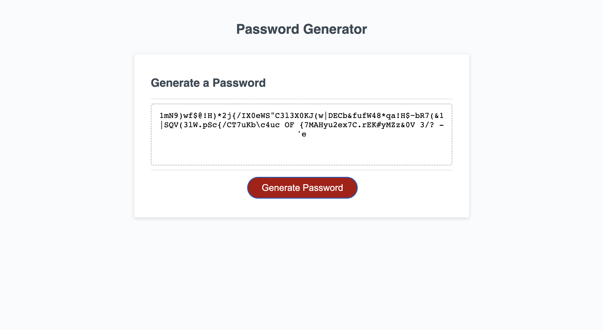

# PasswordGeneratorAC

This project is a password generator that can generate a password between 8-123 characters following user selected criteria. Users are presented with prompts asking if they want numbers, uppercase, lowercase or special character included. 

## Acceptance Criteria

* presented with a series of prompts for password length, numbers, uppercase, lowercase and special characters

* selections are validated and at least one type must be selected. 

* generated password must match selections and be written to the page. 

The following image demonstrates the web application's appearance and functionality:

Website URL: https://acorbridg.github.io/PasswordGeneratorAC/

